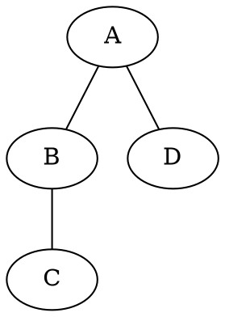
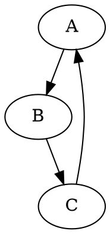

# 🕸️ Projeto de Grafos em Java

Este projeto implementa algoritmos de **busca em grafos (BFS e DFS)** em Java, com suporte à leitura de arquivos `.gv` (formato Graphviz) e geração de **imagens automáticas dos resultados** utilizando a biblioteca [`graphviz-java`](https://github.com/nidi3/graphviz-java).

---

## 🚀 Funcionalidades

- Leitura de grafos a partir de arquivos `.dot` ou `.gv` na pasta `resources/samples/`
- Suporte a grafos **direcionados e não direcionados**
- Implementação dos algoritmos:
    - **BFS (Busca em Largura)**
    - **DFS (Busca em Profundidade)**
- Geração automática de imagens:
    - grafo completo
    - resultado da BFS (arestas e distâncias destacadas)
    - resultado da DFS (ordem de visitação e árvore de busca destacada)

---

## 🧩 Estrutura do Projeto

```
src/
└── main/
├── java/
│ └── br/
│ └── ufrn/
│ ├── Main.java
│ ├── algoritmo/
│ │ ├── BFS.java
│ │ └── DFS.java
│ ├── modelo/
│ │ ├── Grafo.java
│ │ ├── ResultadoBuscaBFS.java
│ │ └── ResultadoBuscaDFS.java
│ └── util/
│ ├── DotReader.java
│ └── GraphVisualizer.java
└── resources/
└── samples/
├── directed_graph.gv
└── undirected_graph.gv
```

## 📥 Instalação

### 1. Clonar o repositório
```bash
git clone https://github.com/seu-usuario/projeto-grafos.gi
cd projeto-grafos
```

### 2. (Opcional) Instalar o Graphviz nativo

Para melhor desempenho e renderização mais rápida das imagens:

#### 🪟 Windows

Baixe em [https://graphviz.org/download/](https://graphviz.org/download/). Marque “Add Graphviz to the system PATH” durante a instalação.

#### 🍎 macOs

```bash
brew install graphviz
```

Verifique se foi instalado corretamente:

```bash
dot -V
```

#### 🐧 Linux
```bash
sudo apt install graphviz
```

Verifique se foi instalado corretamente:

```bash
dot -V
```

### ▶️ Execução

#### Via IntelliJ/Eclipse

Basta rodar a classe:
```
br.ufrn.Main
```

#### Via terminal (Maven)

Basta rodar o seguinte comando no terminal:

```bash
mvn compile exec:java -Dexec.mainClass="br.ufrn.Main"
```

### 📊 Saídas geradas

Após executar o Main, serão geradas automaticamente as imagens na pasta `output/`:

```
output/
├── grafo_nao_direcionado.png
├── bfs_nao_direcionado.png
├── dfs_nao_direcionado.png
├── grafo_direcionado.png
├── bfs_direcionado.png
└── dfs_direcionado.png
```

### ⚠️ Observação importante

Caso queira alterar o grafo inicla, basta editar ou substituir os arquivos dentro de:

```
src/main/resources/samples/
```

Os arquivos padrão são:
- `undirected_graph.gv`: grafo não direcionado
- `directed_graph.gv`: grafo direcionado

Esses arquivos estão no formato DOT (Graphviz), por exemplo:



ou, no caso direcionado:



### 👩‍💻 Alunos

Liriel Antonia de Lima Feliz (20230074399) - Bacharelado em Tecnologia da Informação — UFRN

Lucas Vinicius Dantas de Medeiros (20230072895) - Bacharelado em Tecnologia da Informação — UFRN
